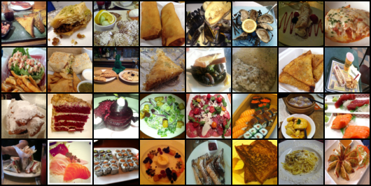
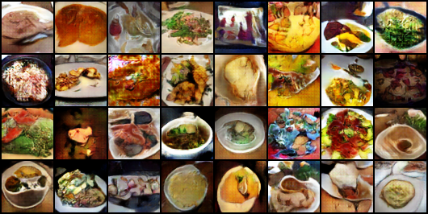
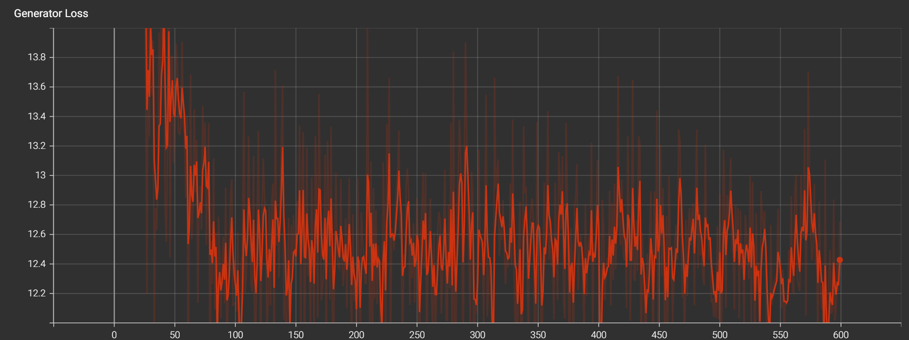
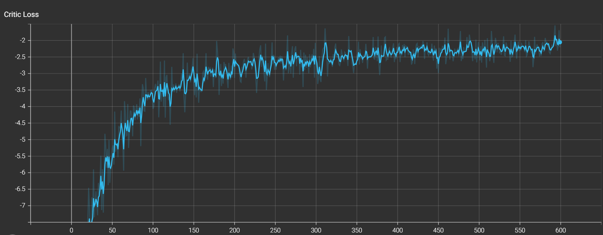

# Food-Images-Generator

- a food iamge genrator using WGAN-GP trained on food-101 data set which contains a 101 food catatogers each have 1000 food image.

- the model was trained for 6 hours (600 epochs) using rtx 4060.

- the model was also test on fashion and mnist datasets and have given a good resulrs for both .

- the model is built according to the [WGAN_GP paper](https://arxiv.org/pdf/1704.00028v3) with almost the same paremeters but with changes in the Discriminator and Generator architectures.

- the results on food-101 dataset :

original image:

generated image:

   Generator Loss:

   Discriminator Loss:

